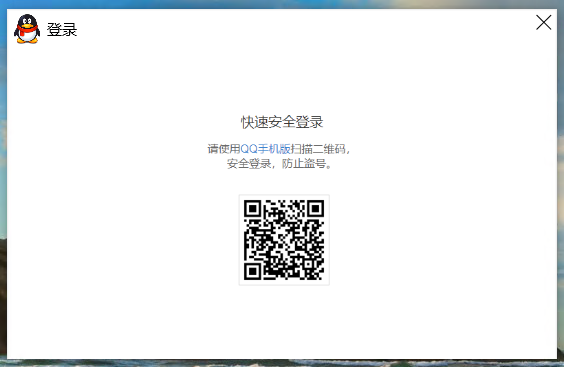

# Qzone
> 想起那天夕阳下的奔跑，那是我逝去的青春
随机显示一条历史说说

    
    
    
    

## 开发环境
Visual Studio 2019 + .Net Core 3.1  
如果只是运行，安装[.Net Core 3.1 Desktop Runtime](https://download.visualstudio.microsoft.com/download/pr/add2ffbe-a288-4d47-8b09-a39c8645f505/8516700dd5bd85fe07e8010e55d8f653/windowsdesktop-runtime-3.1.8-win-x64.exe)即可

## 功能说明
扫码登录后，会随机显示一条历史说说，F5键可以刷新。  
> 扫码链接为官方链接，请放心扫描  
> 无恶意代码，不会对你的账号造成影响

## 界面截图

    </img>
	登录

  

    </img>
	说说

  

    </img>
	说说大图

## 等待完成
* 加载点赞列表
* 加载评论列表

## License
[MIT](LICENSE)
